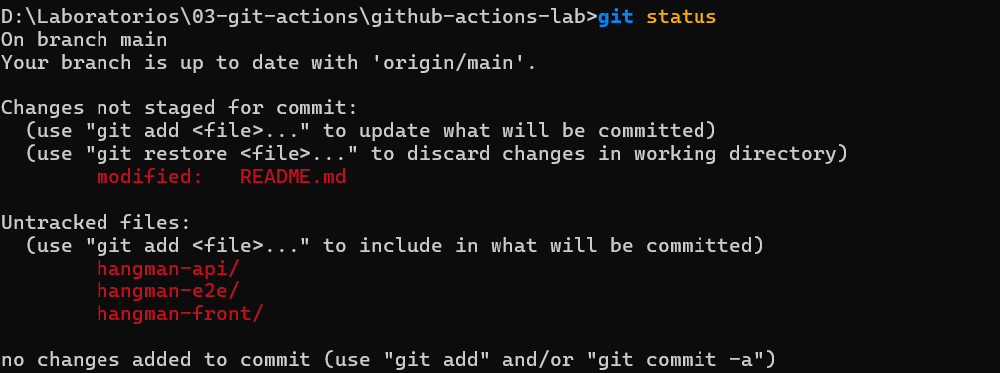
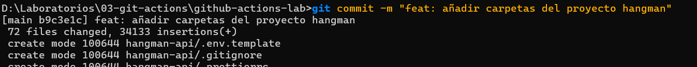
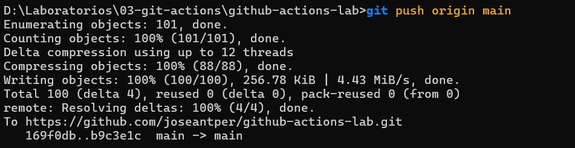
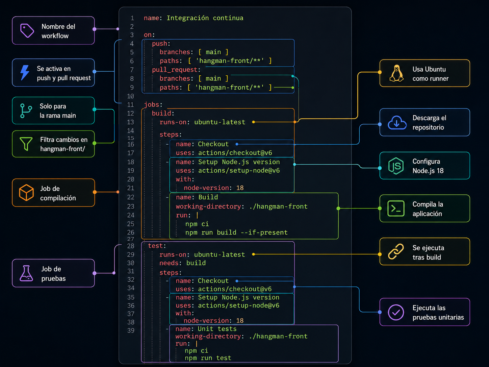

# github-actions-lab de Jose Antonio Perez Alias

<br>
<br>

---

# **¿Qué es GitHub Actions?**

**GitHub Actions** es la herramienta de automatización integrada directamente dentro de GitHub. Te permite crear flujos de trabajo (**workflows**) para compilar, probar y desplegar tu código de forma totalmente automática cada vez que ocurre algo en tu repositorio.

En el mundo de DevOps, es la herramienta que utilizamos para implementar **CI/CD** (Integración Continua y Despliegue Continuo).

## **Los 4 Conceptos Clave**

Para entender cómo funciona, imagina que es una línea de producción con los siguientes elementos:

1. **Workflow (Flujo de trabajo):** Es el proceso automatizado completo. Se escribe en un archivo de configuración .yaml dentro de la carpeta .github/workflows/.  
2. **Event (Evento / Disparador):** Es la chispa que enciende el motor. Por ejemplo, "cuando alguien suba código" (push) o "cuando se abra una solicitud de revisión" (pull\_request).  
3. **Jobs (Trabajos) y Runners:** Un workflow se divide en tareas llamadas *Jobs* (como "compilar" o "testear"). Cada Job se ejecuta en una máquina virtual limpia en la nube de GitHub (llamada *Runner*, que suele ser un servidor Ubuntu, Windows o macOS).  
4. **Actions (Acciones):** Son pequeños bloques de código ya creados por GitHub o por la comunidad que realizan tareas repetitivas (como descargar tu código, configurar Node.js o conectarse a un servidor). ¡Son como "piezas de LEGO" que conectas para armar tu flujo\!

<br>
<br>

---


## **0\. Configuración Inicial del Entorno**


Se inicializa el repositorio remoto bajo el nombre **github-actions-lab**. Acto seguido, se realiza el **commit** inicial que incluye este archivo **README.md** junto con el código fuente de la aplicación **hangman-front**.
<br>
<br>

## **¿Como Exportar el proyecto?** 

1. **Descarga en local:** Conseguimos las carpetas del proyecto original de Lemoncode (hangman-api, hangman-e2e y hangman-front) y las colocamos dentro de nuestro directorio de trabajo local github-actions-lab.
2. **Diagnóstico del estado (git status):** Consultamos a Git para ver qué archivos nuevos teníamos en nuestro ordenador que aún no existían en la nube (GitHub). Detectamos que:  
   * Teníamos las 3 carpetas nuevas sin rastrear (*untracked*).  
   * Teníamos un archivo README.md modificado localmente que **no** queríamos subir todavía porque queríamos redactarlo desde cero.  
2. **Envío a la nube (git push):** Subimos las carpetas a nuestro repositorio remoto de GitHub para que estén disponibles públicamente.
<br>
## **Comandos y Código Utilizado**

A continuación se detalla la secuencia exacta de comandos ejecutados en la terminal para completar el proceso con éxito:

### **1\. Comprobar el estado del repositorio**

Antes de hacer nada, comprobamos qué archivos estaban listos para ser procesados:
```
git status
```
<br>



<br>

* **Resultado:** Git nos mostró en rojo las carpetas nuevas (hangman-\*) y el archivo README.md modificado.
<br>
<br>

### **2\. Preparar selectivamente solo los proyectos**

Para evitar subir el README.md que estamos modificando, preparamos únicamente las carpetas con  sus rutas específicas separadas por un espacio:
```
git add hangman-api hangman-e2e hangman-front
```

### **3\. Crear el punto de guardado local**

Registramos estos cambios en el historial de versiones con un mensaje claro y descriptivo que explique qué estamos añadiendo:
```
git commit \-m "feat: añadir carpetas del proyecto hangman"
```
<br>



<br>

### **4\. Subir los archivos a GitHub**

Finalmente, enviamos las carpetas confirmadas en el paso anterior a la rama principal (main) en el servidor remoto (origin):

```
git push origin main
```
<br>



<br>
<br>
 
----


## **1\. EJERCICIO 1: Diseño del Workflow de CI (Frontend)**

Para el desarrollo del pipeline de integración continua, se crea la rama de trabajo **add-ci-workflow**. El objetivo es implementar un flujo automatizado que valide el código bajo las siguientes condiciones:

### **Disparadores (Triggers)**

El **workflow** se ejecutará de forma automática únicamente cuando se cumplan simultáneamente estos dos requisitos:

1. Se detecten modificaciones en el proyecto **hangman-front**.  
2. Se abra o actualice una **pull request**.

### **Etapas del Pipeline (Jobs)**

* **Build:** Compilación del proyecto para verificar que no existan errores sintácticos o de dependencias.  
* **Unit Tests:** Ejecución de la suite de pruebas unitarias para garantizar la estabilidad del código.

### **Estructura de Archivos**

En GitHub Actions, los flujos de trabajo deben residir en el directorio específico **.github/workflows/** ubicado en la raíz del repositorio.  
Para este primer pipeline de CI, se define el archivo de configuración en formato YAML bajo el nombre **ci.yaml**, quedando la estructura de directorios de la siguiente manera:

## **Anatomía de ci.yaml**

* **Atributo name:** Se define la propiedad fundamental para identificar el flujo en la interfaz de GitHub. Para este caso, lo nombramos como **Integración continua**.

<br>
<br>

Debes crear un nuevo workflow que se dispare cuando haya cambios en el proyecto hangman-front y exista una nueva pull request (deben darse las dos condiciones a la vez). El workflow ejecutará las siguientes operaciones:

    Build del proyecto
    Ejecución de los test unitarios


En nuestro caso vamos a analizarlo por bloques


```YAML

name: Integración continua

on:
  push:
    branches: [ main ]
    paths: [ 'hangman-front/**' ]
  pull_request:
    branches: [ main ]
    paths: [ 'hangman-front/**' ]

jobs:
  build:
    runs-on: ubuntu-latest
  
    steps:
      - name: Checkout
        uses: actions/checkout@v6
      - name: Setup Node.js version
        uses: actions/setup-node@v6
        with:
          node-version: 18
      - name: Build
        working-directory: ./hangman-front
        run: |
          npm ci
          npm run build --if-present

  test:
    runs-on: ubuntu-latest
    needs: build
  
    steps:
      - name: Checkout
        uses: actions/checkout@v6
      - name: Setup Node.js version
        uses: actions/setup-node@v6
        with:
          node-version: 18
      - name: Unit tests
        working-directory: ./hangman-front
        run: |
          npm ci
          npm run test


```
<br>

Vamos a explicar el codigo por bloques

### **1\. El Nombre del Workflow**

YAML  
name: Integración continua

* **¿A qué se refiere?** A la primera línea del archivo. Es el identificador global del pipeline. Este es el texto que leerás en la pestaña "Actions" de tu repositorio de GitHub para saber qué proceso se está ejecutando.

### **2\. Los Disparadores (Eventos)**

YAML  
on:  
  push:  
    branches: \[ main \]  
    paths: \[ 'hangman-front/\*\*' \]  
  pull\_request:  
    branches: \[ main \]  
    paths: \[ 'hangman-front/\*\*' \]

* **¿A qué se refiere?** Al bloque on:. Define las reglas que encienden la automatización.  
* **push / pull\_request**: Le dice a GitHub que actúe cuando alguien empuje código directamente o abra un Pull Request.  
* **branches: \[ main \]**: Limita estos eventos a la rama principal (main). Si trabajas en una rama llamada develop, el pipeline no saltará.  
* **paths: \[ 'hangman-front/' \]**: El filtro inteligente. Solo se activa si los archivos modificados pertenecen a la carpeta del frontend.

### **3\. El Primer Trabajo (Fase de Construcción)**

YAML  
jobs:  
  build:  
    runs-on: ubuntu-latest

* **¿A qué se refiere?** Al inicio del bloque jobs.  
* **build:**: Es el nombre personalizado que le damos a nuestro primer trabajo.  
* **runs-on: ubuntu-latest**: Solicita a GitHub que aprovisione un servidor con la última versión de Ubuntu Linux para ejecutar esta fase.

#### **Pasos del Build (steps)**

YAML  
    steps:  
      \- name: Checkout  
        uses: actions/checkout@v6  
          
      \- name: Setup Node.js version  
        uses: actions/setup-node@v6  
        with:  
          node-version: 18  
            
      \- name: Build  
        working-directory: ./hangman-front  
        run: |  
          npm ci  
          npm run build \--if-present

* **¿A qué se refiere?** A la lista de tareas dentro del trabajo build.  
* **actions/checkout@v6**: Acción que clona el código de tu repositorio dentro del servidor de Ubuntu.  
* **actions/setup-node@v6**: Acción que instala Node.js versión 18 en ese servidor.  
* **run: | ...**: Ejecuta comandos de terminal clásicos. Primero npm ci para instalar dependencias limpias, y luego npm run build para compilar el proyecto frontend. El working-directory asegura que estos comandos se lancen dentro de la carpeta correcta.

### **4\. El Segundo Trabajo (Fase de Pruebas y Dependencia)**

YAML  
  test:  
    runs-on: ubuntu-latest  
    needs: build

* **¿A qué se refiere?** Al segundo bloque principal dentro de jobs, situado al mismo nivel que build.  
* **test:**: El nombre de esta nueva fase. Se ejecutará en un servidor Ubuntu totalmente nuevo e independiente.  
* **needs: build**: **(La parte más importante de este bloque).** Crea un requisito estricto. Significa: *"No empieces a ejecutar el trabajo test hasta que el trabajo build haya terminado correctamente"*. Si build falla, test se cancela.

#### **Pasos del Test (steps)**

YAML  
    steps:  
      \- name: Checkout  
        uses: actions/checkout@v6  
          
      \- name: Setup Node.js version  
        uses: actions/setup-node@v6  
        with:  
          node-version: 18  
            
      \- name: Unit tests  
        working-directory: ./hangman-front  
        run: |  
          npm ci  
          npm run test

* **¿A qué se refiere?** A las tareas de la fase de pruebas.  
* **Repetición de pasos**: Como es una máquina virtual nueva, observa que tenemos que volver a repetir el Checkout (bajar el código) y el Setup Node.js (instalar Node).  
* **run: | npm ci ... npm run test**: Vuelve a instalar las dependencias en esta nueva máquina y finalmente lanza el comando que ejecuta las pruebas unitarias para validar que el código funciona.

<br>
Podemos observar en esta infografía, lo que hace por bloques de forma esquemática




<br>


## 3. La instalacion

### 3.1  Hacemos una rama nueva 

git checkout es un comando de Git que se utiliza para cambiar de rama dentro de un repositorio o para recuperar archivos concretos. Cuando haces algo como git checkout -b nueva-rama, estás creando una nueva rama y moviéndote a ella al mismo tiempo. Las ramas permiten trabajar en cambios o nuevas funcionalidades sin afectar al código principal del proyecto hasta que todo esté listo.

```bash 
git checkout -b add-hangman-front-ci
```

### 3.2 Añadimos el fichero  al repositorio y lo subimos 

```bash 
git add .github/workflows/hangman-front-pr.yml
git commit -m "Add hangman-front pull request CI"
git push origin add-hangman-front-ci
```
