# github-actions-lab de Jose Antonio Perez Alias

<br>
<br>

---

# **¿Qué es GitHub Actions?**

**GitHub Actions** es la herramienta de automatización integrada directamente dentro de GitHub. Te permite crear flujos de trabajo (**workflows**) para compilar, probar y desplegar tu código de forma totalmente automática cada vez que ocurre algo en tu repositorio.

En el mundo de DevOps, es la herramienta que utilizamos para implementar **CI/CD** (Integración Continua y Despliegue Continuo).

## **Los 4 Conceptos Clave**

Para entender cómo funciona, imagina que es una línea de producción con los siguientes elementos:

1. **Workflow (Flujo de trabajo):** Es el proceso automatizado completo. Se escribe en un archivo de configuración .yaml dentro de la carpeta .github/workflows/.  
2. **Event (Evento / Disparador):** Es la chispa que enciende el motor. Por ejemplo, "cuando alguien suba código" (push) o "cuando se abra una solicitud de revisión" (pull\_request).  
3. **Jobs (Trabajos) y Runners:** Un workflow se divide en tareas llamadas *Jobs* (como "compilar" o "testear"). Cada Job se ejecuta en una máquina virtual limpia en la nube de GitHub (llamada *Runner*, que suele ser un servidor Ubuntu, Windows o macOS).  
4. **Actions (Acciones):** Son pequeños bloques de código ya creados por GitHub o por la comunidad que realizan tareas repetitivas (como descargar tu código, configurar Node.js o conectarse a un servidor). ¡Son como "piezas de LEGO" que conectas para armar tu flujo\!

<br>
<br>

---


## **0\. Configuración Inicial del Entorno**


Se inicializa el repositorio remoto bajo el nombre **github-actions-lab**. Acto seguido, se realiza el **commit** inicial que incluye este archivo **README.md** junto con el código fuente de la aplicación **hangman-front**.
<br>
<br>

## **¿Como Exportar el proyecto?** 

1. **Descarga en local:** Conseguimos las carpetas del proyecto original de Lemoncode (hangman-api, hangman-e2e y hangman-front) y las colocamos dentro de nuestro directorio de trabajo local github-actions-lab.
2. **Diagnóstico del estado (git status):** Consultamos a Git para ver qué archivos nuevos teníamos en nuestro ordenador que aún no existían en la nube (GitHub). Detectamos que:  
   * Teníamos las 3 carpetas nuevas sin rastrear (*untracked*).  
   * Teníamos un archivo README.md modificado localmente que **no** queríamos subir todavía porque queríamos redactarlo desde cero.  
2. **Envío a la nube (git push):** Subimos las carpetas a nuestro repositorio remoto de GitHub para que estén disponibles públicamente.
<br>
## **Comandos y Código Utilizado**

A continuación se detalla la secuencia exacta de comandos ejecutados en la terminal para completar el proceso con éxito:

### **1\. Comprobar el estado del repositorio**

Antes de hacer nada, comprobamos qué archivos estaban listos para ser procesados:
```
git status
```
<br>


<br>

* **Resultado:** Git nos mostró en rojo las carpetas nuevas (hangman-\*) y el archivo README.md modificado.
<br>
<br>

### **2\. Preparar selectivamente solo los proyectos**

Para evitar subir el README.md que estamos modificando, preparamos únicamente las carpetas con  sus rutas específicas separadas por un espacio:
```
git add hangman-api hangman-e2e hangman-front
```

### **3\. Crear el punto de guardado local**

Registramos estos cambios en el historial de versiones con un mensaje claro y descriptivo que explique qué estamos añadiendo:
```
git commit \-m "feat: añadir carpetas del proyecto hangman"
```
<br>


<br>

### **4\. Subir los archivos a GitHub**

Finalmente, enviamos las carpetas confirmadas en el paso anterior a la rama principal (main) en el servidor remoto (origin):

```
git push origin main
```
<br>


<br>
<br>
 
----


## **1\. EJERCICIO 1: Diseño del Workflow de CI (Frontend)**

Para el desarrollo del pipeline de integración continua, se crea la rama de trabajo **add-ci-workflow**. El objetivo es implementar un flujo automatizado que valide el código bajo las siguientes condiciones:

### **Disparadores (Triggers)**

El **workflow** se ejecutará de forma automática únicamente cuando se cumplan simultáneamente estos dos requisitos:

1. Se detecten modificaciones en el proyecto **hangman-front**.  
2. Se abra o actualice una **pull request**.

### **Etapas del Pipeline (Jobs)**

* **Build:** Compilación del proyecto para verificar que no existan errores sintácticos o de dependencias.  
* **Unit Tests:** Ejecución de la suite de pruebas unitarias para garantizar la estabilidad del código.

### **Estructura de Archivos**

En GitHub Actions, los flujos de trabajo deben residir en el directorio específico **.github/workflows/** ubicado en la raíz del repositorio.  
Para este primer pipeline de CI, se define el archivo de configuración en formato YAML bajo el nombre **ci.yaml**

### **TRABAJO A REALIZAR**
Debes crear un nuevo workflow que se dispare cuando haya cambios en el proyecto hangman-front y exista una nueva pull request (deben darse las dos condiciones a la vez). El workflow ejecutará las siguientes operaciones:

    Build del proyecto
    Ejecución de los test unitarios
<br>
<br>

## **Anatomía de ci.yaml**


Este es el codigo completo, luego lo analizaremos por bloques


```YAML

name: Integración continua

on:
  push:
    branches: [ main ]
    paths: [ 'hangman-front/**' ]
  pull_request:
    branches: [ main ]
    paths: [ 'hangman-front/**' ]

jobs:
  build:
    runs-on: ubuntu-latest
  
    steps:
      - name: Checkout
        uses: actions/checkout@v6
      - name: Setup Node.js version
        uses: actions/setup-node@v6
        with:
          node-version: 18
      - name: Build
        working-directory: ./hangman-front
        run: |
          npm ci
          npm run build --if-present

  test:
    runs-on: ubuntu-latest
    needs: build
  
    steps:
      - name: Checkout
        uses: actions/checkout@v6
      - name: Setup Node.js version
        uses: actions/setup-node@v6
        with:
          node-version: 18
      - name: Unit tests
        working-directory: ./hangman-front
        run: |
          npm ci
          npm run test


```
<br>


### **1\. El Nombre del Workflow**

```YAML
name: Integración continua
```
* **¿Cuál es el objetivo de esta instrucción?** A la primera línea del archivo. Es el identificador global del pipeline. Este es el texto que leerás en la pestaña "Actions" de tu repositorio de GitHub para saber qué proceso se está ejecutando.

### **2\. Los Disparadores (Eventos)**

```YAML
on:  
  push:  
    branches: \[ main \]  
    paths: \[ 'hangman-front/\*\*' \]  
  pull\_request:  
    branches: \[ main \]  
    paths: \[ 'hangman-front/\*\*' \]
```

* **¿Qué hace exactamente este bloque?** Al bloque on:. Define las reglas que encienden la automatización.  
* **push / pull\_request**: Le dice a GitHub que actúe cuando alguien empuje código directamente o abra un Pull Request.  
* **branches: \[ main \]**: Limita estos eventos a la rama principal (main). Si trabajas en una rama llamada develop, el pipeline no saltará.  
* **paths: \[ 'hangman-front/' \]**: El filtro inteligente. Solo se activa si los archivos modificados pertenecen a la carpeta del frontend.

### **3\. El Primer Trabajo (Fase de Construcción)**

```YAML
jobs:  
  build:  
    runs-on: ubuntu-latest
```
* **¿Para qeu sirve?** Al inicio del bloque jobs.  
* **build:**: Es el nombre personalizado que le damos a nuestro primer trabajo.  
* **runs-on: ubuntu-latest**: Solicita a GitHub que aprovisione un servidor con la última versión de Ubuntu Linux para ejecutar esta fase.

#### **Pasos del Build (steps)**

```YAML
    steps:  
      \- name: Checkout  
        uses: actions/checkout@v6  
          
      \- name: Setup Node.js version  
        uses: actions/setup-node@v6  
        with:  
          node-version: 18  
            
      \- name: Build  
        working-directory: ./hangman-front  
        run: |  
          npm ci  
          npm run build \--if-present
```

* **¿Qué hace exactamente este bloque?** A la lista de tareas dentro del trabajo build.  
* **actions/checkout@v6**: Acción que clona el código de tu repositorio dentro del servidor de Ubuntu.  
* **actions/setup-node@v6**: Acción que instala Node.js versión 18 en ese servidor.  
* **run: | ...**: Ejecuta comandos de terminal clásicos. Primero npm ci para instalar dependencias limpias, y luego npm run build para compilar el proyecto frontend. El working-directory asegura que estos comandos se lancen dentro de la carpeta correcta.

### **4\. El Segundo Trabajo (Fase de Pruebas y Dependencia)**

```YAML 
  test:  
    runs-on: ubuntu-latest  
    needs: build
```

* **¿A qué se refiere?** Al segundo bloque principal dentro de jobs, situado al mismo nivel que build.  
* **test:**: El nombre de esta nueva fase. Se ejecutará en un servidor Ubuntu totalmente nuevo e independiente.  
* **needs: build**: **(La parte más importante de este bloque).** Crea un requisito estricto. Significa: *"No empieces a ejecutar el trabajo test hasta que el trabajo build haya terminado correctamente"*. Si build falla, test se cancela.

#### **Pasos del Test (steps)**

```YAML 
    steps:  
      \- name: Checkout  
        uses: actions/checkout@v6  
          
      \- name: Setup Node.js version  
        uses: actions/setup-node@v6  
        with:  
          node-version: 18  
            
      \- name: Unit tests  
        working-directory: ./hangman-front  
        run: |  
          npm ci  
          npm run test
```

* **¿Cómo afecta esto al workflow?** A las tareas de la fase de pruebas.  
* **Repetición de pasos**: Como es una máquina virtual nueva, observa que tenemos que volver a repetir el Checkout (bajar el código) y el Setup Node.js (instalar Node).  
* **run: | npm ci ... npm run test**: Vuelve a instalar las dependencias en esta nueva máquina y finalmente lanza el comando que ejecuta las pruebas unitarias para validar que el código funciona.

<br>
<br>

Podemos observar en esta infografía, lo que hace por bloques de forma esquemática


<br>


## 3. La instalacion

### 3.1  Hacemos una rama nueva 

git checkout es un comando de Git que se utiliza para cambiar de rama dentro de un repositorio o para recuperar archivos concretos. Cuando haces algo como git checkout -b nueva-rama, estás creando una nueva rama y moviéndote a ella al mismo tiempo. Las ramas permiten trabajar en cambios o nuevas funcionalidades sin afectar al código principal del proyecto hasta que todo esté listo.

```bash 
git checkout -b add-hangman-front-ci
```
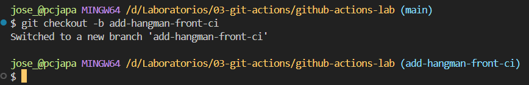

<br>

### 3.2 Añadimos el fichero  al repositorio y lo subimos 

```bash 
git add .github/workflows/hangman-front-pr.yml
git commit -m "Add hangman-front pull request CI"
git push origin add-hangman-front-ci
```
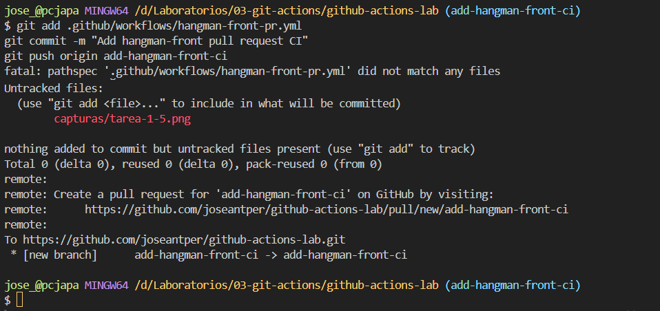

<br>

Modificamos fichero app.tsx

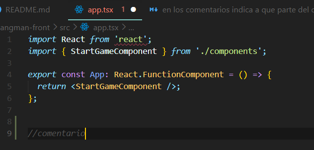

incluimos un comentario
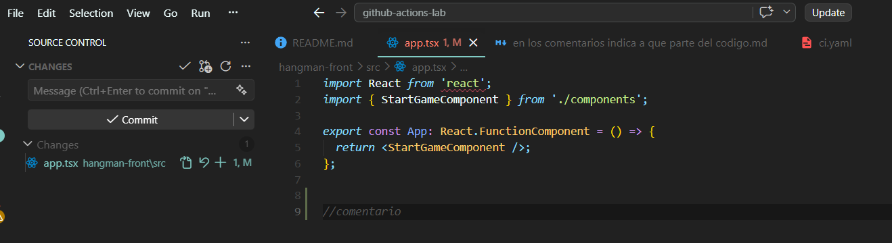

Sincronizamos los cambios con nuestro github
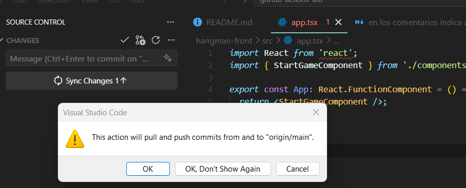

Nos aparece que hay cambios en la rama
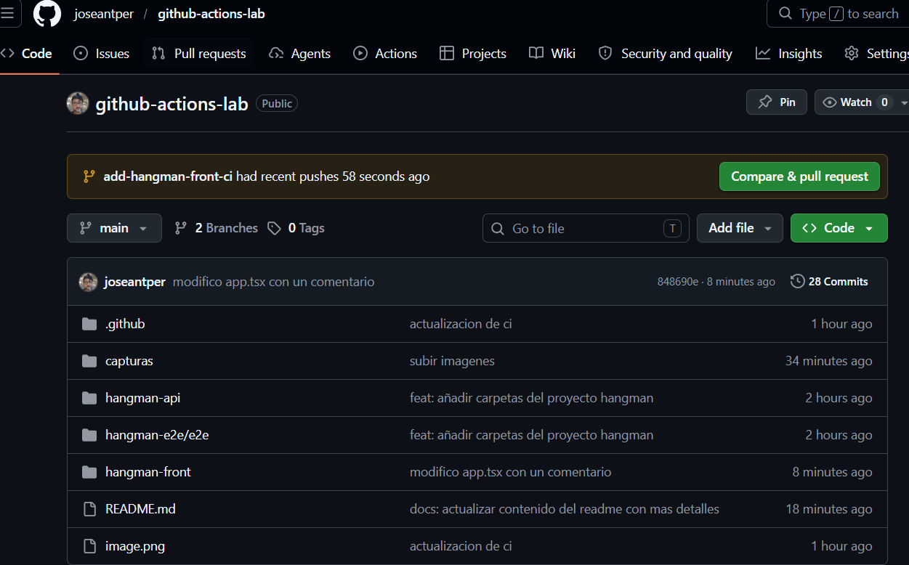

Pulsamos Compare y pull request, y vemos los cambios
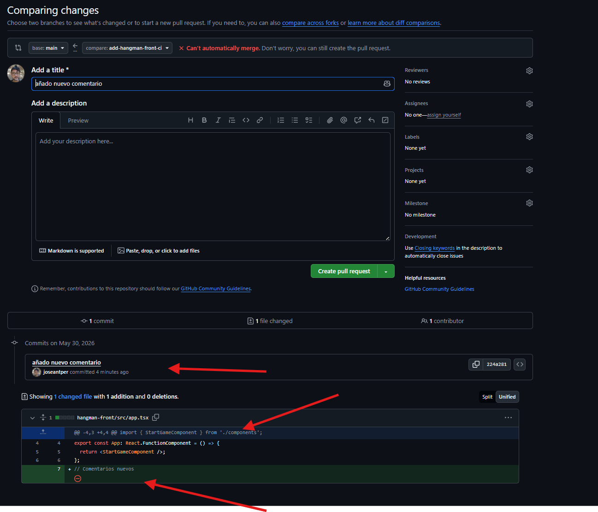

Nos aparece un conflicto, porque por error mio, habia modificado la rama main y la rama add-hangman-front-ci
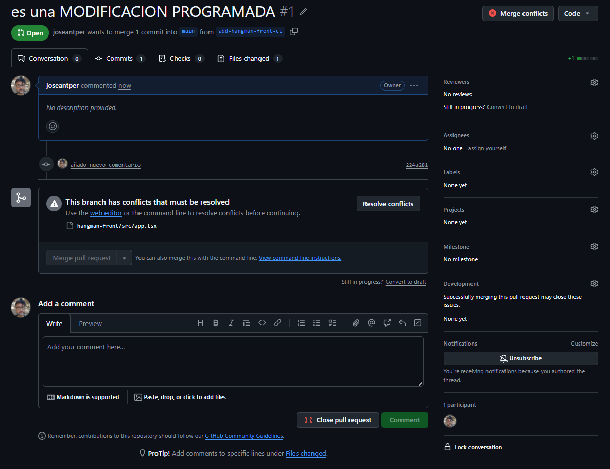

Solucionamos el conflicto
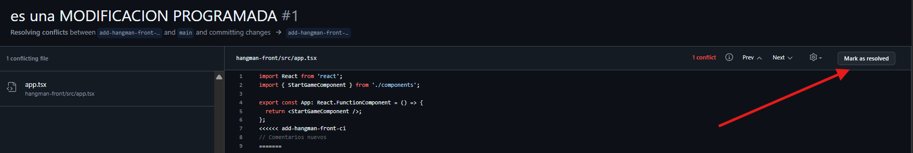
Elegimos con cual de los comentarios queremos quedarnos, nos aparecen los 2 que eran diferentes
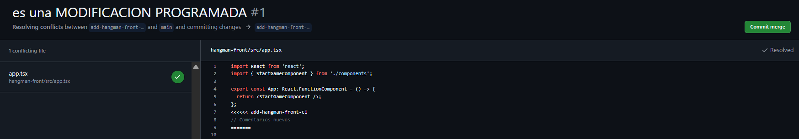
Una vez resuelto el conflicto, le damos a comit merge y aparece esta pantalla
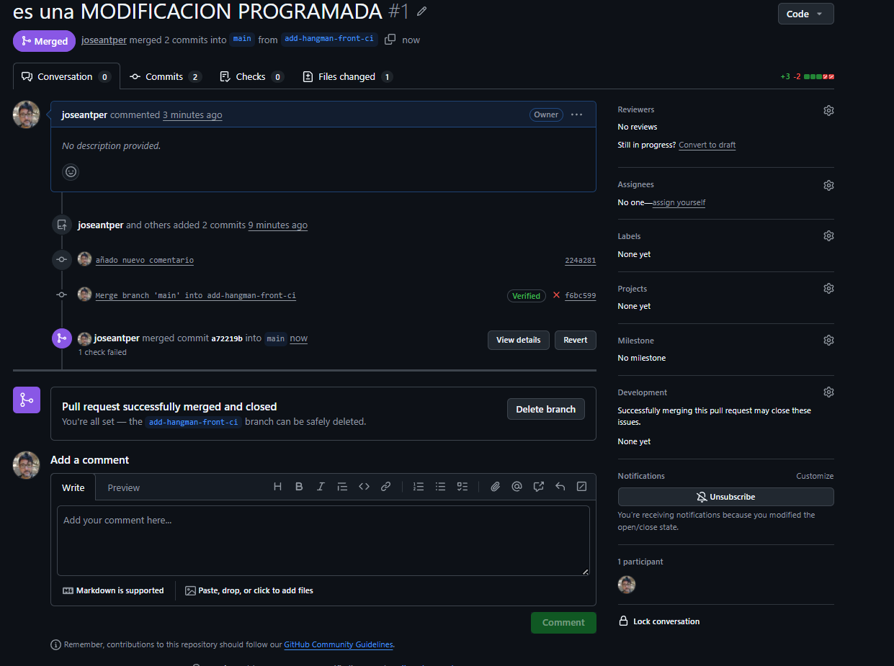
Aqui vemos que los cambios entre ramas se nos ha ido de las manos, estamos en actions, solo buscabamos la de la líena superior, pero hemos aprendido un montón sobre las ramas, y como quedarse colgado de una rama
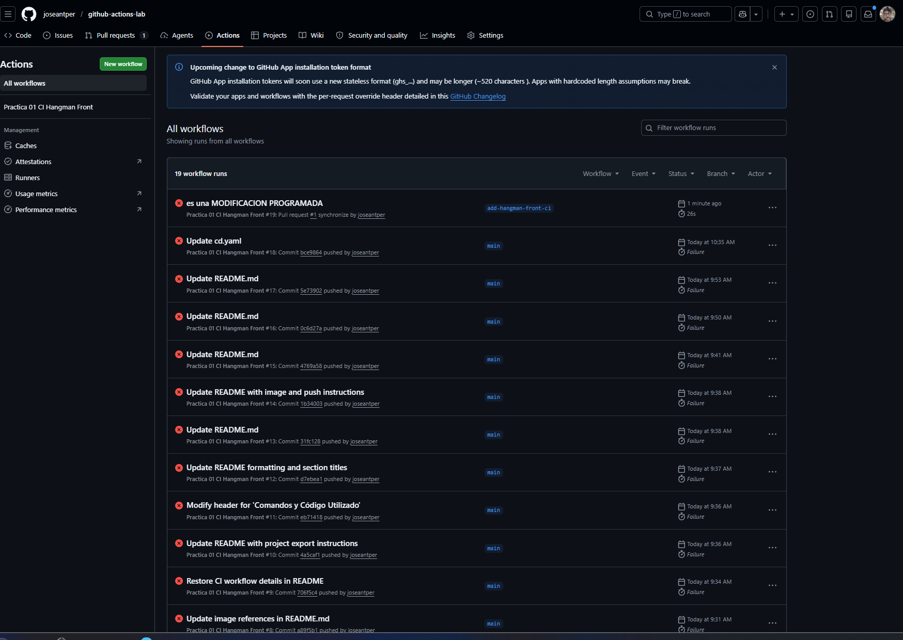
Como se aprecia hemos estado saltando de rama en rama, con lo que hemos aprendido que cuando cambias de rama, hasta desaparecen los archivos creados en tu ordenador. Ostia gorda
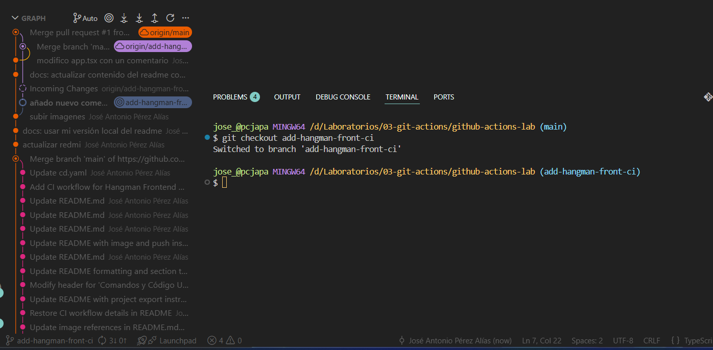
Finalmente, hemos hecho un cambio en github, pero habria que traerlo a nuestro visual estudio para seguir trabajando en local. En verdad esto no lo pedia, pero el camino se ido haciendo al andar
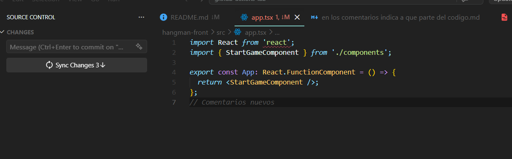


<br>
<br>
<br>
<br>

----


## **1\. EJERCICIO 2:  Workflow de CD (Frontend)**

Crea un nuevo workflow que se dispare manualmente y haga lo siguiente:

    Crear una nueva imagen de Docker
    Publicar dicha imagen en el container registry de GitHub

    Nota: intenta usar las actions de Docker vistas en clase


## 2. Como lo hacemos? 
### 1º Creando el fichero YAML

Esto se esta haciendo muy largo, vamos al modo micromachine, paso el codigo comentado para facilitar interprestacon

```YAML 

name: Docker Publish

# Controla cuándo se ejecuta el workflow
on:
  workflow_dispatch: # Permite activar el despliegue manualmente desde la pestaña "Actions" de GitHub

# Configuración de permisos seguros para el token automático de GitHub
permissions:
  contents: read    # Permiso para leer el código de tu repositorio
  packages: write  # Permiso crucial para poder subir la imagen a GitHub Packages (GHCR)

jobs:
  docker:
    runs-on: ubuntu-latest # Ejecuta el proceso en una máquina virtual Linux limpia

    steps:
      # 1. Descarga el código fuente del repositorio en la máquina virtual
      - name: Checkout repository
        uses: actions/checkout@v4

      # 2. Configura Buildx, el motor moderno de Docker que permite optimizaciones y caché
      - name: Setup Docker Buildx
        uses: docker/setup-buildx-action@v3

      # 3. Inicia sesión en el registro de contenedores de GitHub (GHCR)
      - name: Login to GitHub Container Registry
        uses: docker/login-action@v3
        with:
          registry: ghcr.io
          username: ${{ github.actor }} # Usa automáticamente tu nombre de usuario de GitHub
          password: ${{ secrets.GITHUB_TOKEN }} # Usa el token temporal interno para autenticarse

      # 4. Extrae de forma inteligente las etiquetas y metadatos (evita escribir rutas a mano)
      - name: Extract Docker metadata
        id: meta
        uses: docker/metadata-action@v5
        with:
          images: ghcr.io/${{ github.repository }} # Estructura el nombre: ghcr.io/tu-usuario/tu-repo

      # 5. Construye la imagen de Docker y la sube a GitHub Packages
      - name: Build and push Docker image
        uses: docker/build-push-action@v6
        with:
          context: ./hangman-front # UBICACIÓN: Carpeta donde está el código del frontend
          file: ./hangman-front/Dockerfile # RUTA: Dónde está físicamente tu Dockerfile
          push: true # Le indica que no solo la cree, sino que la suba a internet
          tags: ${{ steps.meta.outputs.tags }} # Aplica de forma dinámica las etiquetas generadas en el paso anterior
          labels: ${{ steps.meta.outputs.labels }} # Añade metadatos útiles a la imagen (autor, fecha, etc.)
```

<br>
A continuación se presenta una infografia del codigo comentado por bloques

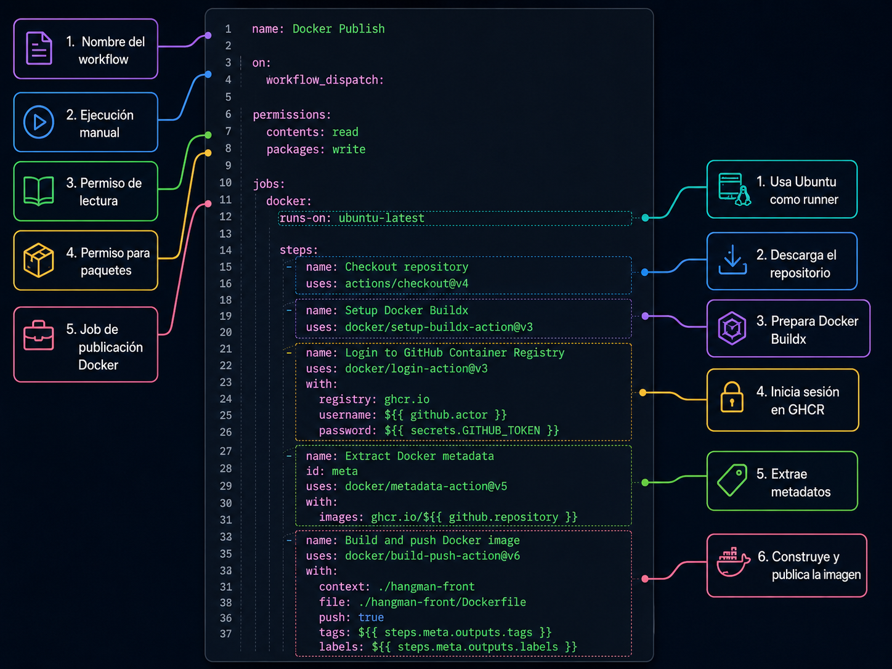

<br>

## 3. Como lo instalamos ? 


### 3.1 Añadimos el fichero  al repositorio y lo subimos 

```
git add .github/workflows/cd.yaml
git commit -m "ci: añadir workflow de despliegue continuo cd.yaml"
git push origin main
```
<br>

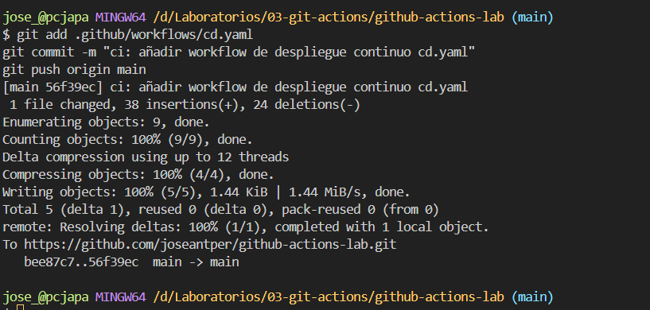


### 3.2 En GitHub, ir a Action y Seleccionar Docker Publish

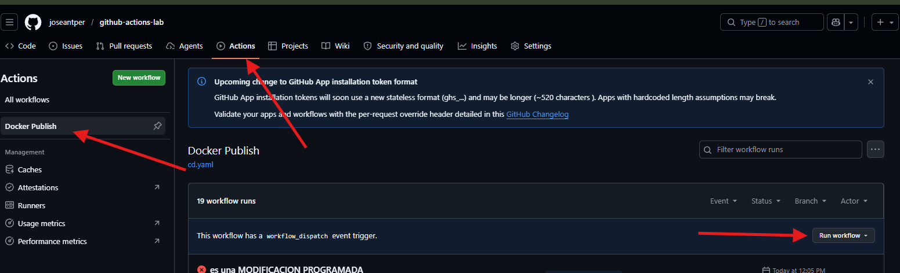

### 3.3 Al pulsaar RUN WORKFLOW el docker comienza a ejecutarse
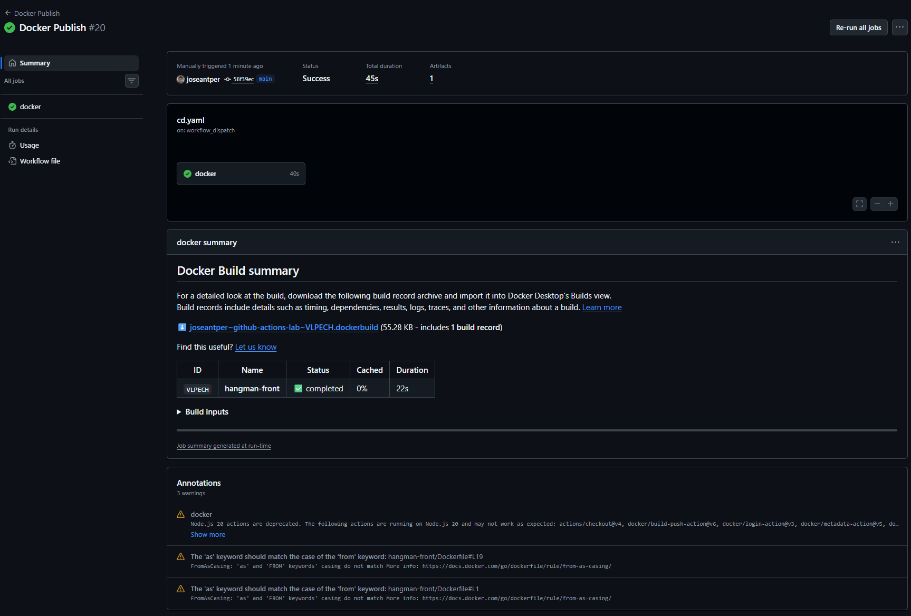

<br>
<br>

Esta pantalla demuestra que todo el trabajo de Despliegue Continuo (CD) que configuramos en los pasos anteriores ha funcionado a la perfección.

Los puntos clave son los siguientes:

* **Ejecución exitosa:** El flujo de trabajo que configuramos se ha completado de principio a fin sin ningún error, tardando apenas 45 segundos en hacer todo el proceso.  
* **Lectura de nuestras instrucciones:** El sistema de GitHub ha leído correctamente los pasos que le indicamos dentro del archivo cd.yaml que subimos antes a la rama principal.  
* **Construcción de la aplicación:** Siguiendo esas instrucciones, el servidor ha cogido el código fuente de nuestro **hangman-front**  y ha construido la imagen de Docker correctamente.  
* **Objetivo de CD cumplido:** El paso final y más importante es que ha publicado esa imagen automáticamente. Gracias a esto, el código ya no solo es un texto guardado en un repositorio, sino que se ha convertido en un paquete terminado y listo para ser instalado o desplegado en cualquier servidor de producción.


<br>
<br>

---


# Guía de Supervivencia Git: Comandos Principales

Durante esta práctica de Integración y Despliegue Continuo (CI/CD), hemos utilizado varios comandos esenciales de Git para gestionar nuestras ramas, resolver conflictos y forzar la sincronización con el repositorio remoto.Aquí dejo un resumen de los más importantes:

## 1. Flujo de Trabajo Básico (Guardar y Subir)
El ciclo normal para empaquetar archivos y subirlos a la nube.

```
# 1. Preparar todos los archivos modificados (o usar la ruta de un archivo específico)
git add .

# 2. Sellar el paquete con un mensaje descriptivo
git commit -m "docs: añadir capturas y actualizar readme"

# 3. Subir los cambios a la rama principal en GitHub
git push origin main
```


## 2. Gestión y Cambio de Ramas
Comandos para navegar entre distintas versiones del proyecto.

```
# Ver en qué rama estoy actualmente (la activa tiene un asterisco *)
git branch

# Cambiar a una rama ya existente (ej: volver a main)
git checkout main

# Crear una rama NUEVA y cambiarme a ella automáticamente
git checkout -b nombre-de-nueva-rama
```

## 3. Sincronización y Fusión
Para mantener el ordenador local y GitHub al día.

```
# Descargar a mi ordenador los últimos cambios que hay en GitHub
git pull origin main

# Fusionar los cambios de una rama secundaria hacia la rama actual
git merge nombre-rama-secundaria

# 🆘 ABORTAR: Cancelar una fusión si aparecen ventanas raras o conflictos
git merge --abort
```

## 4. Forzar y Sobrescribir (Modo "Peligro / Rescate")
Estos comandos son muy útiles cuando el historial local y el de la nube se desincronizan y sabemos perfectamente qué versión queremos imponer.

A) Imponer lo que hay en mi PC hacia GitHub (Sobrescribir la nube):
```
# Obligar a GitHub a borrar su versión y aceptar exactamente la mía
git push origin main --force
```

B) Imponer lo que hay en GitHub hacia mi PC (Sobrescribir mi ordenador):Si mi local está roto y quiero descargar la versión limpia de la nube:
```
# 1. Descargar la información fresca de internet
git fetch origin

# 2. Forzar a que mi ordenador sea EXACTAMENTE igual a la nube (borra lo no guardado)
git reset --hard origin/main
```

### 5 Solo sobreescribir el readme.md
```
git add README.md

git commit -m "docs: añadir chuleta de comandos git al readme"

git push origin main
```
